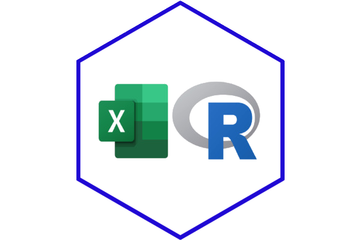
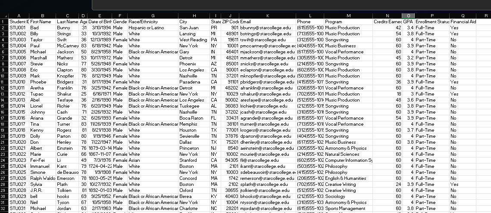

```{r}
#| label: setup
library(tidyverse)
library(readxl)

slide_data_1 <- read_excel("data/data_example_1.xlsx")

# Read in data examples
```

## Session Overview
::: {style="font-size: 0.85em;"}
In this session, we will cover the use of Spreadsheet software *(like Excel)* in IR/IE workflows as well as the benefits and potential tradeoffs of transitioning to R.
:::
:::: {.columns}
::: {.column width="60%" style="font-size: 0.65em;"}
Session Objectives
 
- Evaluate the benefits and tradeoffs of using Excel vs. R for IR/IE workflows.
- Identify projects and workflows that would benefit from transitioning to R.
- Formulate first steps for transitioning to R for IR/IE work.
 
:::
 
::: {.column width="40%"}
{width=100% style="font-size: 0.5em;"}
:::
::: {.notes}
- Introduce the value of the session to the attendees.
    - Attendees will be able to evaluate the benifets and trade offs of switching to R.
    - Identify their own projects or processes that could be done in R
    - Formulate the first steps of transitioning to R.
:::
::::
 
## Is this you?
{width=100% style="font-size: 0.3em;"}
 
::: {.notes}
- Does managing large reports or datasets in excel cause chaos in your office?
- Does updating columns or formulas manually take up to much time?  
- Do you feel overwhelmed by tracking changes or managing shared access in excel?
:::
 
## The Reality of IR/IE Workflows in Excel
::: {style="font-size: 0.75em;"}
The reality is that many IR/IE professionals rely heavily on spreadsheet software like Excel for data management, analysis, and reporting. While Excel is a powerful tool, it has limitations that can hinder efficiency and accuracy in IR/IE workflows.
:::
 
::: {style="font-size: 0.65em;"}
- **Scalability**: Excel can struggle with large reports or datasets, leading to slow performance and potential crashes.
- **Reproducibility**: Manual processes in Excel can lead to errors, waste valuable time, and make it difficult to reproduce analyses.
- **Version Control and Collaboration**: Sharing Excel files can lead to version control issues and difficulties in tracking changes.
:::
 
:::{.notes}
Excel is a powerful tool that many IE/IR Professionals and entire offices rely on. It can however hinder their ability to be effecient, accruate, and consistant.
Excel has problems with Scalability, Reporducability, and Version Control/Collaboration (Reference examples in bullets)
:::
 
## From Spreadsheets to Scripts
::: {style="font-size: 0.75em;"}
Transitioning from spreadsheets to scripts in R can offer several benefits for IR/IE professionals, including improved efficiency, reproducibility, and scalability.
:::
 
::: {style="font-size: 0.65em;"}
- **Efficiency**: R allows for automation of repetitive tasks, reducing the time spent on manual data manipulation and analysis.
- **Reproducibility**: R scripts can be easily shared and rerun, ensuring that analyses can be reproduced and verified by others.
- **Scalability**: R can handle larger datasets more efficiently than Excel, making it suitable for more complex analyses and larger projects.
:::
 
::::{.columns}
::: {.column width="50%"}
{width=100% style="font-size: 0.5em;"}
:::
::: {.column width="50%"}

```{r}
#| label: r-script-example
#| echo: true
# reading_data <- read_excel("data/ir_data.xlsx")
# cleaned_data <- reading_data |>
#     filter(!is.na(student_id)) |>
#     mutate(grade = as.numeric(grade))

```

:::
::::
 
 
## Live Examples: Excel &rarr; R
 
## Benefits *and* Tradeoffs
 
## First Steps for Your Own Transition
 
## Resources, Tools, and Community
- [R Project for Statistical Computing](https://www.r-project.org/)
- [Rstudio, Positron, Quarto & Posit](https://posit.co/)
- [ThIRsdays IR and IE Community of Practice](https://www.reddit.com/r/ThIRsdays/)
- [R for Data Science](https://r4ds.had.co.nz/)
- [Moving from Excel to R](https://dataviz.shef.ac.uk/blog/08/10/2020/moving-from-excel-to-r)
 
:::{.notes}
Here are a few resources for getting into R for IE/IR. Talk about each resource and more.
:::
 
## Q&A {.center}
[]{style="color: #1E541E; display: flex; justify-content: center; align-items: center; height: 70vh;"}
 
:::{.notes}
Any questions? I am happy to help.
:::
 
## Thank You! {.center}
 
Connect with me!
 
:::: {.columns}
 
::: {.column width="50%"}
[](https://www.linkedin.com/in/logan-king-91607b1ab)
&nbsp; Logan King
:::
 
::: {.column width="50%"}
[](mailto:rking3387@haywood.edu)
&nbsp; rking3387@haywood.edu
:::
 
:::{.notes}
Please reach out to me with any questions you may have. Here is my email and LinkedIn.
:::
 
::::