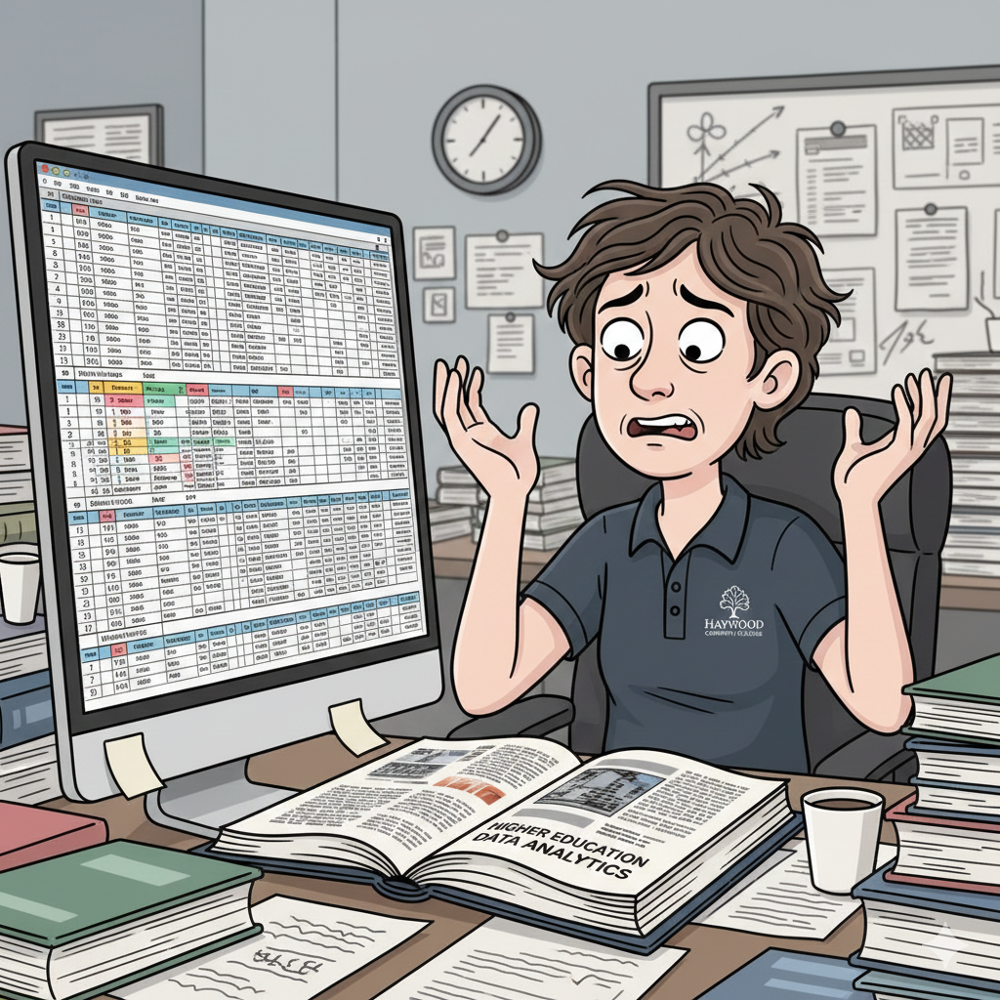

## Is This You?
::: {style="font-size: 0.55em;"}
{width=60%}
:::

::: {.notes}
- 📋 You're copying and pasting data from three different reports into one master file
- 📁 Your folder contains: `report_final.xlsx`, `report_final_v2.xlsx`, `report_final_FINAL.xlsx`, `report_final_FINAL_use_this_one.xlsx`
- 🎨 You just spent 45 minutes reformatting a table — and someone changed the source data
- 🐌 Excel is frozen because you accidentally loaded 200,000 rows of enrollment history
- 😬 A formula quietly broke two weeks ago and no one noticed until the Board meeting
If any of this sounds familiar... you're in the right room.
:::

## Session Overview

**What you'll leave with today:**

1. Evaluate the benefits and trade-offs of transitioning IR/IE workflows from Excel to R
2. Identify 2–3 IR/IE tasks currently done in Excel that can be migrated to R
3. Formulate next steps for beginning your own transition

**A quick note on what this session is NOT:**

> This is not a coding workshop. You will see code on the screen — and that's intentional — but we won't teach syntax line by line. Instead, we'll look at real examples from institutional research work and leave with actionable next steps you can take back to your office on Monday.

:::{.notes}
- Set expectations early — reassure anyone who's nervous about code.
- Emphasize that the goal is awareness and readiness, not proficiency by end of session.
:::

## The Reality of IR/IE Workflows in Excel

::: {style="font-size: 0.75em;"}
Most IR/IE offices live in Excel — and for good reason. It's accessible, flexible, and everyone knows it.
:::

::: {style="font-size: 0.65em;"}
- **Reproducibility:** Can you recreate last year's report from scratch? Can someone else?
- **Version control:** Which file is the real one? What changed between versions?
- **Copy-paste errors:** Manual data movement introduces mistakes that are hard to catch
- **Formula fragility:** One deleted row can silently break a calculation downstream
- **Scalability limits:** Large datasets slow Excel to a crawl — or crash it entirely
- **Tedious manual updates:** Each new reporting cycle means repeating the same steps by hand
:::

We don't use Excel because it's the best tool for everything. We use it because it's the tool we have.

:::{.notes}
- Invite the audience to relate — ask how many have experienced one of these pain points.
- Don't be dismissive of Excel; the goal is to add a tool, not attack a familiar one.
:::

## From Spreadsheets to Scripts

::: {style="font-size: 0.75em;"}
Transitioning to R can address each of these pain points directly.
:::

::: {style="font-size: 0.65em;"}
| Excel Challenge | R Solution |
|---|---|
| Reproducibility | Scripts document every step — run it again, get the same result |
| Version control | Works seamlessly with Git; track every change |
| Copy-paste errors | Data flows through code, not manual transfers |
| Formula fragility | Logic is explicit, testable, and auditable |
| Scalability | Handles millions of rows without breaking a sweat |
| Tedious manual updates | Automate the repetitive stuff; spend time on analysis |
:::

**The core toolkit:**

::: {style="font-size: 0.65em;"}
- **R** — The language itself; free and open source
- **RStudio / Positron** — The coding environment (like Excel's interface, but for R)
- **Quarto** — Turn your R code into polished reports, presentations, and websites
- **Shiny** — Build interactive data dashboards without knowing web development
:::

## Live Examples: Excel &rarr; R

## Example 1: IPEDS Reporting

::::{.columns}
::: {.column width="48%" style="font-size: 0.65em;"}
**Excel Workflow**

- Manually download data files from IPEDS
- Copy-paste values across multiple workbooks
- Apply formatting adjustments by hand each cycle
- Aggregations done with SUMIF/VLOOKUP formulas
- Errors discovered after submission (sometimes)
- Process repeated from scratch each year
:::
::: {.column width="48%" style="font-size: 0.65em;"}
**R Workflow**

- Script imports and joins data automatically
- Cleaning and aggregation logic is written once, reused every cycle
- Output is consistent and auditable
- Errors caught before they become problems
- New year = re-run the script

```{r}
#| eval: false
# Read raw IPEDS data file
ipeds_raw <- read_csv("ipeds_fall_enrollment.csv")

# Filter, group, and summarize in one pipeline
ipeds_summary <- ipeds_raw |>
  filter(institution_id == my_unitid) |>
  group_by(year, race_ethnicity, gender) |>
  summarize(headcount = sum(students), .groups = "drop")
```

:::
::::

<!-- INSERT SCREENSHOT -->

:::{.notes}
This is one of the most time-consuming cyclical tasks in IR. The key selling point here is that the R script becomes the documentation — anyone can open it and understand exactly what was done. With Excel, the logic often lives only in the analyst's head.
:::

## Example 2: Executive Team Reports

::::{.columns}
::: {.column width="48%" style="font-size: 0.65em;"}
**Excel Workflow**

- Pull data from multiple sources into Excel
- Rebuild charts and tables manually each reporting period
- Format everything to match branding guidelines
- Export to PDF or copy-paste into Word/PowerPoint
- One data change = update every chart by hand
- Reports look slightly different each time
:::
::: {.column width="48%" style="font-size: 0.65em;"}
**R Workflow**

- Quarto document connects directly to data
- Charts and tables regenerate automatically
- Consistent formatting defined once in a template
- Render to PDF, HTML, or Word with one command
- Data change = re-render; everything updates

```{r}
#| eval: false
# A Quarto report renders this automatically
enrollment_trend |>
  ggplot(aes(x = term, y = headcount, color = student_type)) +
  geom_line(linewidth = 1.2) +
  geom_point(size = 3) +
  labs(
    title = "Enrollment Trend by Student Type",
    x = "Term",
    y = "Headcount"
  ) +
  theme_minimal()
```

:::
::::

<!-- INSERT SCREENSHOT -->

:::{.notes}
The "re-render" workflow is genuinely transformative for anyone who produces recurring reports. The chart code is written once. When enrollment data updates, you just run the document again. No manual reformatting, no copy-paste into PowerPoint — it just works.
:::

## Example 3: General Education Assessment

::::{.columns}
::: {.column width="48%" style="font-size: 0.65em;"}
**Excel Workflow**

- Data lives in separate files from each program or course
- Manually combine files each assessment cycle
- Calculate aggregate statistics by hand or with fragile formulas
- Visualizations built individually for each outcome
- Hard to compare results across years or programs
- Process is not documented — tribal knowledge only
:::
::: {.column width="48%" style="font-size: 0.65em;"}
**R Workflow**

- R reads and merges all source files automatically
- Consistent rubric scoring logic applied across all data
- Summary statistics generated for every outcome at once
- Plots produced programmatically and consistently
- Year-over-year comparisons easy to add

```{r}
#| eval: false
# Read all assessment files from a folder at once
all_assessments <- list.files(
  path = "data/gen_ed/",
  pattern = "*.csv",
  full.names = TRUE
) |>
  map(read_csv) |>
  list_rbind()

# Summarize scores by outcome
all_assessments |>
  group_by(outcome, rating) |>
  count() |>
  mutate(pct = n / sum(n))
```

:::
::::

<!-- INSERT SCREENSHOT -->

:::{.notes}
General education assessment is a perfect candidate for R because it typically involves pulling together data from many different sources. The `list.files()` + `map()` pattern shown here is a real workhorse — it reads every file in a folder and stacks them automatically.
:::

## Example 4: Program Review Data Summaries

::::{.columns}
::: {.column width="48%" style="font-size: 0.65em;"}
**Excel Workflow**

- A separate workbook for each program under review
- Manual copy-paste from enrollment, grades, and completion data
- Multiple versions floating around as updates are made
- Charts rebuilt from scratch for each program
- Inconsistencies between program reports are common
- Coordinator spends days on data prep before any analysis
:::
::: {.column width="48%" style="font-size: 0.65em;"}
**R Workflow**

- One centralized script handles all programs
- Data pulled from a single source of truth
- Parameterized reports: one template, many outputs
- Plots and tables consistent across all programs
- Updates are instant when source data changes

```{r}
#| eval: false
# Parameterized report: swap program name,
# get a fresh report for any program
params <- list(program = "Nursing")

# Filter data for the target program
program_data <- enrollment |>
  filter(program_name == params$program)

# Render a full report for that program
quarto_render(
  input = "program_review_template.qmd",
  execute_params = params
)
```

:::
::::

<!-- INSERT SCREENSHOT -->

:::{.notes}
Parameterized reporting is one of the most impressive things to demo for administrators. Instead of building 40 separate Excel workbooks for 40 programs, you build one Quarto template and render it 40 times — each one customized automatically.
:::

## Benefits *and* Tradeoffs

**It's not a magic wand — but it is a better tool for a lot of what we do.**

::::{.columns}
::: {.column width="48%" style="font-size: 0.65em;"}
**Benefits**

- ✅ **Reproducibility** — Scripts are documentation; anyone can rerun your work
- ✅ **Automation** — Repetitive tasks run in seconds, not hours
- ✅ **Scalability** — Millions of rows, no sweat
- ✅ **Version control** — Git tracks every change, with notes
- ✅ **Professional outputs** — Quarto produces polished reports and presentations
- ✅ **Free and open source** — No licensing costs
:::
::: {.column width="48%" style="font-size: 0.65em;"}
**Tradeoffs & Challenges**

- ⚠️ **Learning curve** — R takes time to learn; the first month is humbling
- ⚠️ **Migration investment** — Rebuilding existing workflows takes real effort up front
- ⚠️ **Organizational adoption** — IT, leadership, and colleagues all need buy-in
- ⚠️ **Not everything should migrate** — A quick one-off calculation? Excel is fine
- ⚠️ **Support structures** — You may be the only R user in your office (for now)
:::
::::

:::{.notes}
It's important to be honest about the tradeoffs here. R is not universally better than Excel — it's better for a specific class of problems. The goal isn't to eliminate Excel, it's to reach for a more appropriate tool when the task calls for it. The learning curve is real, but the community and resources available today make it far more accessible than it was even five years ago.
:::

## First Steps for Your Own Transition

::: {style="font-size: 0.75em;"}
**How do you know what to migrate?** Look for tasks that are repetitive, data-heavy, error-prone, or frequently updated.
:::

::::{.columns}
::: {.column width="50%" style="font-size: 0.65em;"}
**How to approach the migration:**

1. Start with *one* task — not your most complex report
2. Rebuild it in R while keeping the Excel version as a check
3. Validate your R output against the known Excel result
4. Once confident, retire the Excel version
:::
::: {.column width="50%" style="font-size: 0.65em;"}
**How to build organizational support:**

- Show your work — share a polished Quarto report with your supervisor
- Involve IT early — especially around data access and file storage
- Find an internal champion — one curious colleague can make a difference
- Be patient with yourself and others — adoption takes time
:::
::::

## Resources, Tools, and Community

::::{.columns}
::: {.column width="50%" style="font-size: 0.65em;"}
**Tools**

- [R Project](https://www.r-project.org/)
- [RStudio](https://posit.co/products/open-source/rstudio/)
- [Positron](https://github.com/posit-dev/positron)
- [Quarto](https://quarto.org/)
- [Shiny](https://shiny.posit.co/)

**Learning**

- [ThIRsdays](https://thirdays.com/) — IR-focused R tutorials by David Eubanks, Furman University
- [R for Data Science](https://r4ds.hadley.nz/) — Free online book; the best place to start
- [Quarto Documentation](https://quarto.org/docs/guide/)
:::
::: {.column width="50%" style="font-size: 0.65em;"}
**Community**

- [Posit Community Forums](https://community.rstudio.com/)
- [IR/IE colleagues](URL) — more offices are making this transition

**AI & Coding Assistants**

- GitHub Copilot, Claude, and ChatGPT can help you learn R syntax, debug errors, and understand unfamiliar code
- Use them as a tutor, not a shortcut
:::
::::

:::{.notes}
ThIRsdays is especially worth highlighting — it's built specifically for IR and IE professionals learning R, with real examples from the field.
:::

## Q&A {.center}

[]{style="color: #1E541E; display: flex; justify-content: center; align-items: center; height: 70vh;"}

:::{.notes}
Any questions? I am happy to help.
:::

## Thank You! {.center}

Connect with me!

::::{.columns}
::: {.column width="50%"}
[](https://www.linkedin.com/in/logan-king-91607b1ab)
&nbsp; Logan King
:::
::: {.column width="50%"}
[](mailto:rking3387@haywood.edu)
&nbsp; rking3387@haywood.edu
:::
::::

:::{.notes}
Please reach out to me with any questions you may have. Here is my email and LinkedIn.
:::
