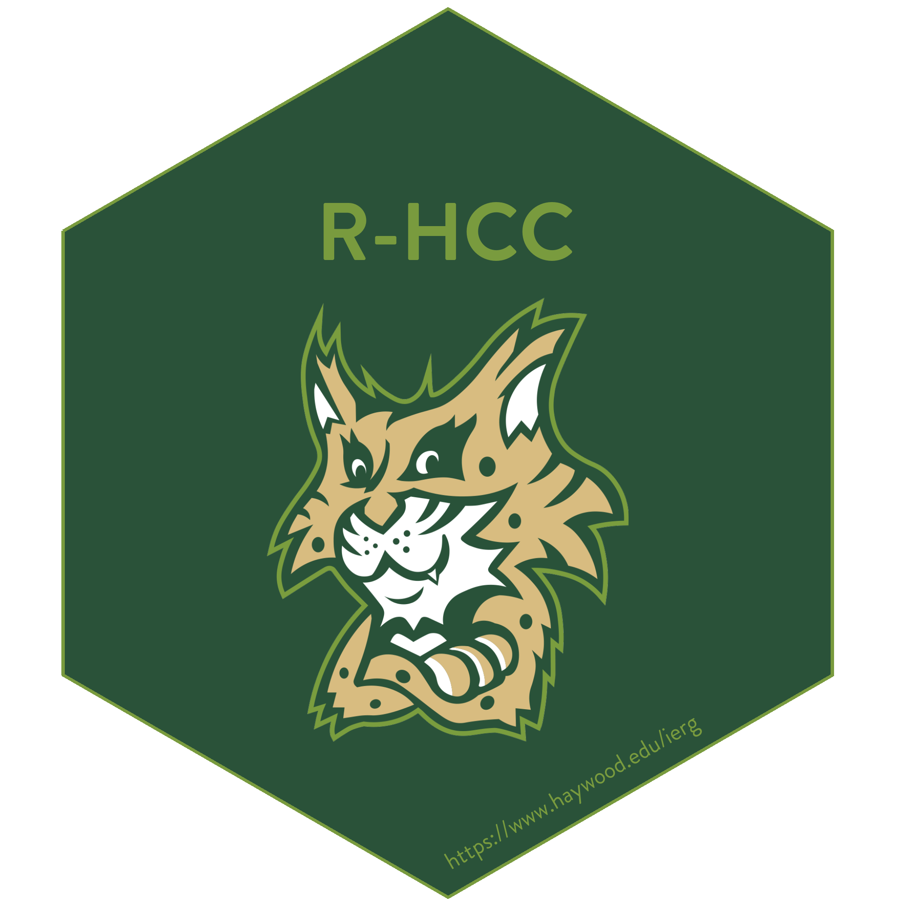
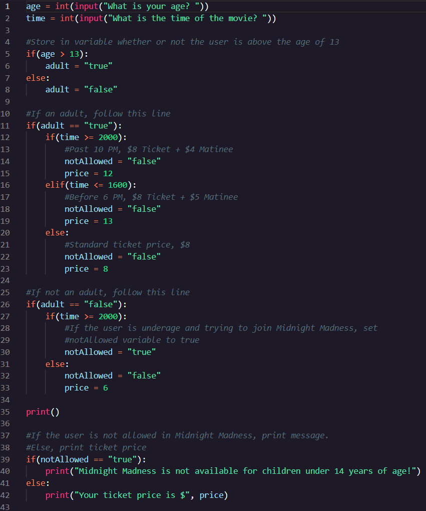
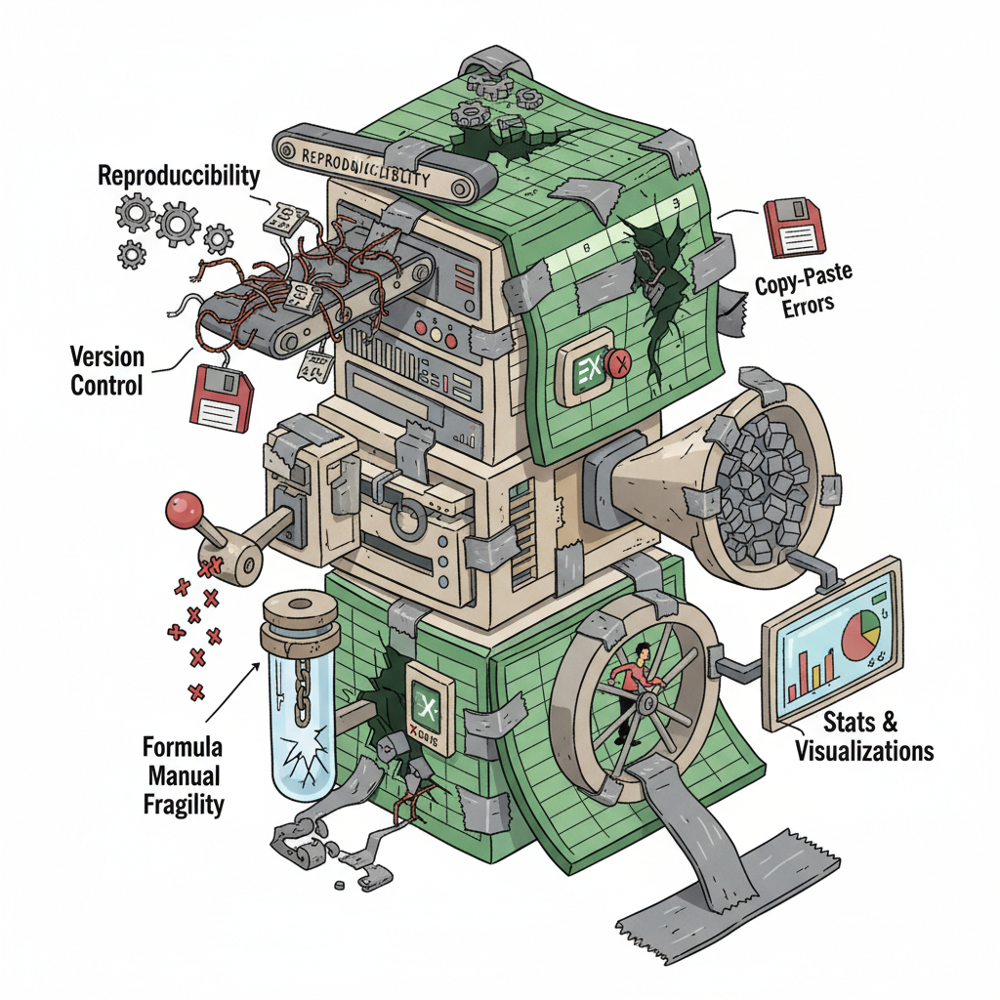
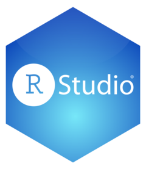
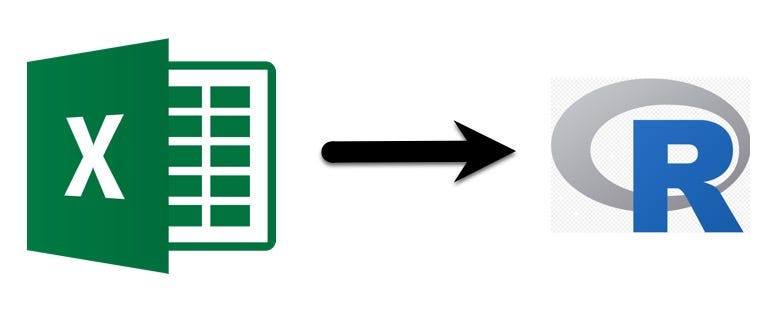
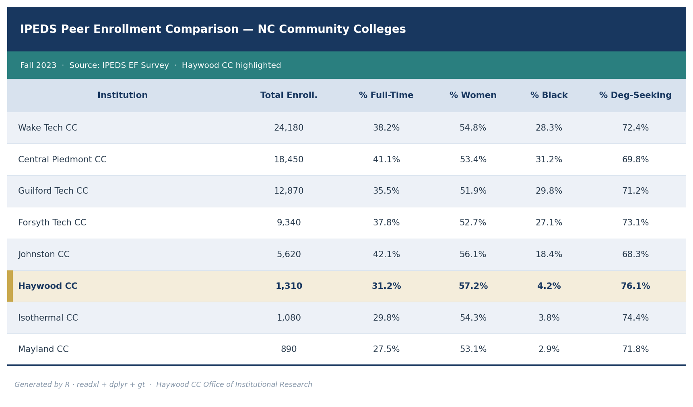
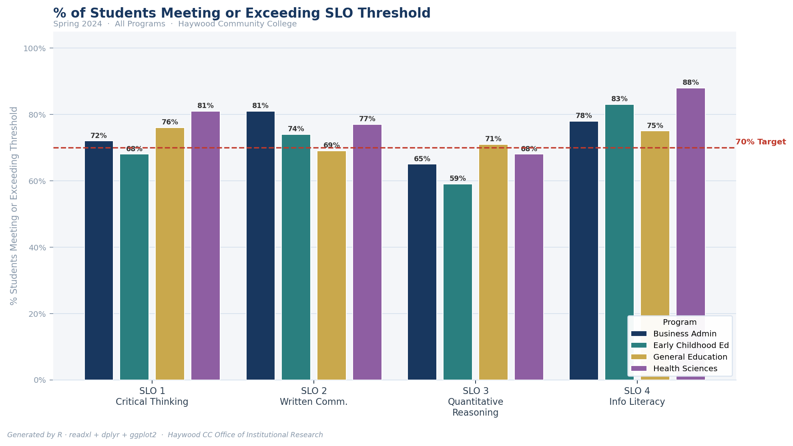
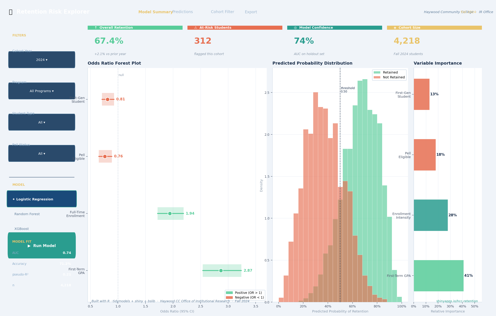

## A little about Haywood CC
:::{style="font-size: 0.45em;"}
{width=30% fig-align="center"}
:::

:::::{style="font-size: 0.50em;"}
::::{.columns}
:::{.column width="25%"}
- ~1300 Students in Curriculum
- ~2700 Students in Continuing Education *(25-26)*
- 30+ Academic Programs
- Over 50% of Courses offered online
:::

:::{.column width="50%"}
Mission: We serve the educational needs and economic growth of our community, by promoting lifelong student learning and success.
:::

:::{.column width="25%"}
- 2027 Aspen Prize Nominee
- Unique programs in Natural Resources and Professional Crafts
- Have a Lumberjack Team!
:::
::::
:::::
:::{.notes}
Haywood is a community college in Clyde NC.
:::

## Is This You?
::: {style="font-size: 0.55em;"}
{width=40%}
:::

::: {.notes}
Does this sound like you?

- A folder full of files with names like `report_final_v2_FINAL.xlsx`
- Copying and pasting data or formulas across multiple workbooks.
- Large datasets or analyses that crash Excel or take forever to run.

If any of this sounds familiar... you're in the right room.
:::

## Session Overview

**What will you be able to do after today:**

1. Evaluate the benefits and trade-offs of transitioning from Excel to R
2. Identify 2–3 IR/IE tasks currently done in Excel that can be migrated to R
3. Formulate next steps for beginning your own transition

:::{.notes}
- Set expectations early about the session. Give them the key takeaways and what they can expect to walk away with.
:::

## A quick note on what this session is NOT:
::::{.columns}
::: {.column width="45%"}
{width=67%}
:::

:::{.column width="10%"}
&rarr;
:::
::: {.column width="45%"}
{width=100%}
:::
::::
:::{.notes}
- This is not a coding workshop. You will see code on the screen and that's intentional but we won't look at syntax line by line. Instead, we'll look at real examples from IR/IE work and leave with actionable next steps you can take back to your office on Wednesday. Think nice things we aren't getting in the weeds
:::

## The Reality of IR/IE Workflows in Excel

::: {style="font-size: 0.75em;"}
Most IR/IE offices live in Excel, and for good reason. It's accessible, flexible, and everyone knows it.
:::

::: {style="font-size: 0.65em;"}
- **Reproducibility:** Can you recreate last year's report from scratch? Can someone else?
- **Version control:** Which file is the real one? What changed between versions?
- **Copy-paste errors:** Manual data movement introduces mistakes that are hard to catch.
- **Formula fragility:** One deleted row can silently break a calculation downstream.
- **Scalability limits:** Large datasets slow Excel to a crawl or crash it entirely.
- **Tedious manual updates:** Each new reporting cycle means repeating the same steps by hand.
- **Stats & Visualizations:** Excel's built-in stats tools are limited and not designed for complex analyses or visualizations.
:::

We don't use Excel because it's the best tool for everything. We use it because it's the tool we have.

:::{.notes}
- Invite the audience to relate, ask how many have experienced one of these pain points.
- Don't be dismissive of Excel; the goal is to add a tool, not attack a familiar one.
:::

## Whats the fix?
{width=48%}

:::{.notes}
- The good news is that there is a better way to do this work. We can transition to a more modern, powerful, and efficient workflow using R.
:::

## From Spreadsheets to Scripts

::: {style="font-size: 0.75em;"}
Transitioning to R can address each of these pain points directly.
:::

::: {style="font-size: 0.65em;"}
| Excel Challenge | R Solution |
|---|---|
| Reproducibility | Scripts document every step. Run it again and again, get the same report. |
| Version control | Works seamlessly with Git and Github; track every change. |
| Copy-paste errors | Data flows through code, not manual transfers. |
| Formula fragility | Logic is explicit, testable, and auditable. |
| Scalability | Handles millions of rows without breaking a sweat. |
| Tedious manual updates | Automate the repetitive stuff. Spend time on analysis. |
| Stats & Visualizations | Powerful libraries for complex analyses and stunning visuals. |
:::
:::{.notes}
- Note the things R can do for the items in the table. This is the core value proposition of the session.
:::


## The core toolkit:
:::::{.columns}
:::: {style="font-size: 0.65em;"}
::: {.column width="25%"}
**Programming Language**

{width=50%}
:::
::: {.column width="25%"}
**Integrated Development Environment (IDE)**
{width=50%}
{width=50%}
:::
::: {.column width="25%"}
**Reporting & Visualization**
{width=50%}
:::
::: {.column width="25%"}
**Interactive Apps and Dashboards**
{width=50%}
:::
::::
:::::
:::{style="font-size: 0.45em;"}
*Source: Posit & R-Project* 
:::
:::{.notes}
- Introduce core tools for R ecosystem. R is the language, RStudio and Positron are the IDEs, Quarto (or R Markdown but outdated) is for reporting, and Shiny is for interactive dashboards. You don't need everything, but it's good to have a sense of the ecosystem.
- Tools are open source and have large communities for support. Great for offices with limited budgets.
:::
## Live Examples: Excel &rarr; R


:::{.notes}
- Now let's look at some real examples of how specific IR/IE tasks can be done in R.
:::

## Example 1: IPEDS Comparisons

::::{.columns}
::: {.column width="50%" style="font-size: 0.62em;"}
**The Excel workflow:**

- Pull peer data manually from IPEDS Data Center
- Manually manipulate data to build 1 table
- Build pivot tables for each metric by hand
- Recreate charts every reporting cycle from scratch
- Static output: one Excel file nobody else can easily update
```
IPEDS_Peers_2024_FINAL_v2_USE_THIS.xlsx
```

**The result:** Hours of work to answer one question: *"How do we compare?"*
:::

::: {.column width="50%" style="font-size: 0.62em;"}
```r
library(readxl); library(dplyr); library(gt)

df <- read_excel("IPEDS_NC_CC_Enrollment_Fake.xlsx", sheet = "IPEDS_EF_Data")

df |>
  mutate(
    pct_ft       = ENRFT / ENRTOT,
    pct_women    = UGENRW / UGENRTOT,
    pct_black    = UGENR_BLACK / UGENRTOT,
    pct_deg_seek = DEG_SEEKING / UGENRTOT
  ) |>
  select(INSTNM, ENRTOT, pct_ft, pct_women, pct_black, pct_deg_seek) |>
  arrange(desc(ENRTOT)) |>
  gt() |>
  fmt_integer(columns = ENRTOT) |>
  fmt_percent(columns = c(pct_ft, pct_women, pct_black, pct_deg_seek), decimals = 1)
```

*One script. Swap the file next year. Done.*
:::
::::

:::{.notes}
- Talk through excel process
- Clean data table creation, great for quarto report.
:::

## Example 1: Potential Output 


:::{.notes}
- More complex version of previous.
:::

## Example 2: SLO Assessment

::::{.columns}
::: {.column width="50%" style="font-size: 0.62em;"}
**The Excel workflow:**

- Collect rubric scores across faculty via emailed spreadsheets
- Manually consolidate into a master workbook
- Calculate means by hand or with fragile cell references
- Re-paste into Word or PowerPoint for the assessment report
- Repeat every semester with a new set of files
```
SLO_Spring2024_CONSOLIDATED_v3_Logans_version_FINAL.xlsx
```

**The result:** Hours lost to data wrangling before any actual analysis begins.
:::

::: {.column width="50%" style="font-size: 0.62em;"}
```r
library(readxl); library(dplyr); library(ggplot2)

df <- read_excel("SLO_Rubric_Scores.xlsx")

df |>
  group_by(program, outcome) |>
  summarise(
    n          = n(),
    mean_score = mean(score, na.rm = TRUE),
    pct_meets  = mean(score >= 3, na.rm = TRUE)
  ) |>
  ggplot(aes(x = outcome, y = pct_meets, fill = program)) +
  geom_col(position = "dodge") +
  scale_y_continuous(labels = scales::percent) +
  labs(
    title = "% of Students Meeting or Exceeding SLO Threshold",
    x = "Student Learning Outcome",
    y = NULL, fill = "Program"
  ) +
  theme_minimal()
```

*Add a new semester's file. Rerun. Updated report, no copy-paste required.*
:::
::::

:::{.notes}
- Go through excel process.
- Highlight group by, summarize and ggplot2
:::

## Example 2: Potential Output


:::{.notes}
- Graphing abilities!
:::

## Example 3: Statistical Analysis

::::{.columns}
::: {.column width="50%" style="font-size: 0.62em;"}
**The Excel workflow:**

- Use Data Analysis ToolPak, if it's even installed
- Results paste as static, unformatted output into the sheet
- Re-run manually every time data changes
- No easy path to regression, SEM, or forests
- Visualizations require separate power chart stepss
```
retention_analysis_2024_stats_attempt2.xlsx
```

**The result:** Analysis limited by what Excel's toolbox can do, not by your research questions.
:::

::: {.column width="50%" style="font-size: 0.62em;"}
```r
library(readxl); library(tidymodels); library(probably)

df <- read_excel("Student_Retention_Fake.xlsx") |>
  mutate(retained = factor(RETAINED, levels = c("No", "Yes")))

# Define model spec and recipe
log_spec <- logistic_reg() |> set_engine("glm")

rec <- recipe(retained ~ FIRST_GEN + PELL_ELIG + ENROLL_INTENSITY + GPA_TERM1,
              data = df) |>
  step_dummy(all_nominal_predictors())

# Fit via workflow
wf <- workflow() |>
  add_recipe(rec) |>
  add_model(log_spec) |>
  fit(data = df)

# Tidy coefficients with odds ratios
wf |>
  tidy(exponentiate = TRUE, conf.int = TRUE) |>
  filter(term != "(Intercept)") |>
  select(term, estimate, conf.low, conf.high, p.value)
```

*Logistic regression, in eleven lines. Swap the outcome variable and rerun for any question.*
:::
::::

:::{.notes}
- Talk about potential for strong analysis and modeling abilities.
:::

## Example 3: Potential Outcome


:::{.notes}
- Talk about shiny!
:::

## Benefits *and* Tradeoffs

**It's not a magic wand, but it is a better tool for a lot of what we do.**

::::{.columns}
::: {.column width="48%" style="font-size: 0.65em;"}
**Benefits**

- ✅ **Reproducibility**: Scripts are documentation; anyone can rerun your work
- ✅ **Automation**: Repetitive tasks run in seconds, not hours
- ✅ **Scalability**: Millions of rows, no sweat
- ✅ **Version control**: Git tracks every change, with notes
- ✅ **Professional outputs**: Quarto produces polished reports and presentations
- ✅ **Free and open source**: No licensing costs
:::
::: {.column width="48%" style="font-size: 0.65em;"}
**Tradeoffs & Challenges**

- ⚠️ **Learning curve**: R takes time to learn, but there are pleant of resources
- ⚠️ **Migration investment**: Rebuilding existing workflows takes real effort up front
- ⚠️ **Organizational adoption**: IT, leadership, and colleagues all need buy-in
- ⚠️ **Not everything should migrate**: A quick one-off calculation? Excel is fine
- ⚠️ **Support structures**: You may be the only R user in your office (for now)
:::
::::

:::{.notes}
- Be honest about the trade offs for R and adoption issues.
:::

## First Steps for Your Own Transition

::: {style="font-size: 0.75em;"}
**How do you know what to migrate?** Look for tasks that are repetitive, data-heavy, error-prone, or frequently updated.
:::

::::{.columns}
::: {.column width="50%" style="font-size: 0.65em;"}
**How to approach the migration:**

1. Start with *one* task, not your most complex report
2. Rebuild it in R while keeping the Excel version as a check
3. Validate your R output against the known Excel result
4. Once confident, retire the Excel version
:::
::: {.column width="50%" style="font-size: 0.65em;"}
**How to build organizational support:**

- Show your work: share a polished Quarto report with your supervisor
- Involve IT early: especially around data access and file storage
- Find an internal champion: one curious colleague can make a difference
- Be patient with yourself and others: adoption takes time
:::
::::

:::{.notes}
- Go through steps!
:::

## Resources, Tools, and Community

::::{.columns}
::: {.column width="50%" style="font-size: 0.65em;"}
**Tools**

- [R Project](https://www.r-project.org/)
- [RStudio](https://posit.co/products/open-source/rstudio/)
- [Positron](https://github.com/posit-dev/positron)
- [Quarto](https://quarto.org/)
- [Shiny](https://shiny.posit.co/)

**Learning**

- [R for Data Science](https://r4ds.hadley.nz/) — Free online book; the best place to start
- [Quarto Documentation](https://quarto.org/docs/guide/)
:::
::: {.column width="50%" style="font-size: 0.65em;"}
**Community**

- [Posit Communities](https://posit.co/data-science-hangout/)
- [ThIRsdays](https://www.reddit.com/r/ThIRsdays/) — IR-focused R tutorials by David Eubanks, Furman University

**AI & Coding Assistants**

- GitHub Copilot, Claude, and ChatGPT can help you learn R syntax, debug errors, and understand unfamiliar code
- Use them as a tutor, not a shortcut
:::
::::

:::{.notes}
- Highlight tools and open source nature, learning resources, communities to join, and ability of AI to assist in R learning and coding.
:::

## Q&A {.center}

[]{style="color: #85A600; display: flex; justify-content: center; align-items: center; height: 70vh;"}

:::{.notes}
Any questions? I am happy to help.
:::

## Thank You! {.center}

Connect with me!

::::{.columns}
::: {.column width="50%"}
[](https://www.linkedin.com/in/logan-king-91607b1ab)
&nbsp; Logan King
:::
::: {.column width="50%"}
[](mailto:rking3387@haywood.edu)
&nbsp; rking3387@haywood.edu
:::
::::

:::{.notes}
Please reach out to me with any questions you may have. Here is my email and LinkedIn.
:::